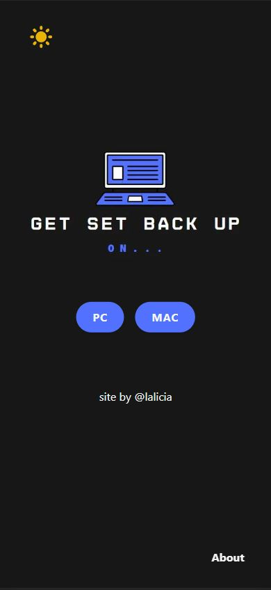
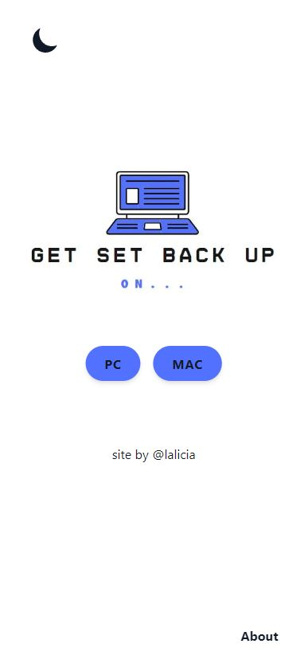
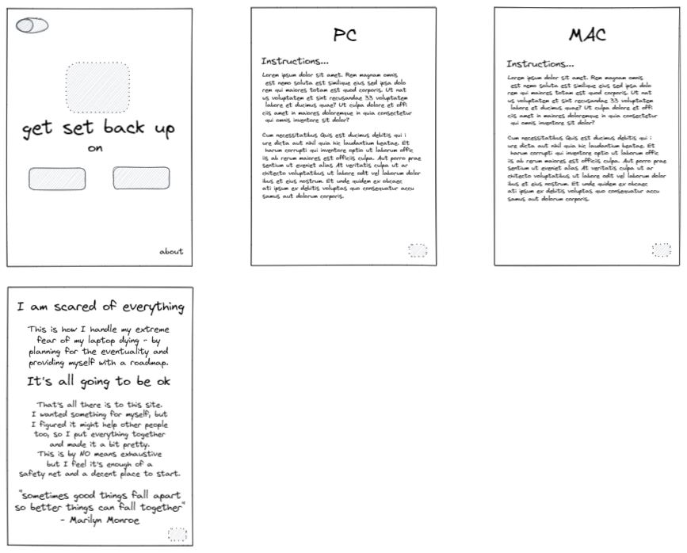

# Get Set Back Up

[Visit the site](https://get-set-back-up.vercel.app/)

## Screenshots

Homepage:

 

## The Project

Having a deep-seated fear of my laptop failing, I'd been thinking for a while how much it would suck trying to remember how to set the coding environment back up. Individual projects, sure - clone from GitHub and npm i to my heart's content...but the actual nuts and bolts TO code? I've only set that up once and no way do I remember how to do it again.

So I put together notes from instructions School of Code had provided at the beginning of the course, and I added more pointers that I thought would be useful - as well as consulting with [Katie Walters](https://github.com/KatieClarinet), my resident expert having suffered from laptop failure THREE times during the bootcamp. I compiled these into a document and then worked on some low-fidelity wireframes in Excalidraw.

I decided that as I wanted to keep the presentation of the site very simple (it's a lot of text and I didn't want the UI to be otherwise fussy and add stress to the UX) I wasn't going to produce high-fidelity versions of the wireframes as they had enough direction for me to produce from. I did however, create logos and buttons using Canva, as though the app was to be minimal I wanted it to look cool and professional. The logo design also determined my colour theme and font choices, to keep everything very streamlined and easy on the eye.

## The Build

I decided to use Next.js along with Tailwind, as I've only used these techs once before when following a beginner project provided by Next. I wanted to further explore the technologies and bed-in the principles by constructing my own project, and this was really useful in allowing me to explore features and grapple with functionality.

The app is responsive and optimised for both desktop and mobile so that if people are trying to reinstall software they can access it away from their main computer if that's more helpful. There's also a darkmode feature because hey, we're coders! :smile:

## Tech

Next, React, Tailwind, CSS, JavaScript, HTML, Vercel

## Some Thoughts

I learned quite a lot about certain features of Next, such as the Image import (Next not having img as I'm used to using), as well as the in-built functionality for an error page using 404.js. Something I did struggle a lot with was implementing the darkmode feature; I needed access to the currentTheme state to display the correct version of the logo, and all implementations of darkmode I could find were abstracted away from other pages and components. I tried to reposition this a number of times to be able to pass the state as a prop where I needed it, but was ultimately unsuccessful - so I moved the entire darkmode feature into the index.js where I needed access to the state. I'd love to know how I could have done this, but ultimately this is a drawback of self-teching, in that sometimes you don't always know why something didn't work!

Still, I was happy to be able to implement it finally, even if it was slightly differently!

I also learned a lot about Tailwind and tried to use it for the bulk of all styling. It felt pretty unnatural to begin with, but once I got the hang of passing arbitrary values and picked up some of the syntax, I did find it a lot nicer to use than I'd expect to from looking at the documentation beforehand.
